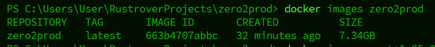
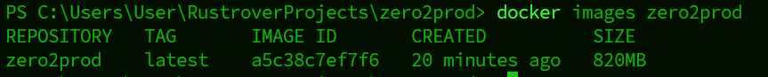
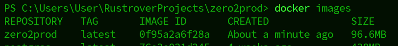
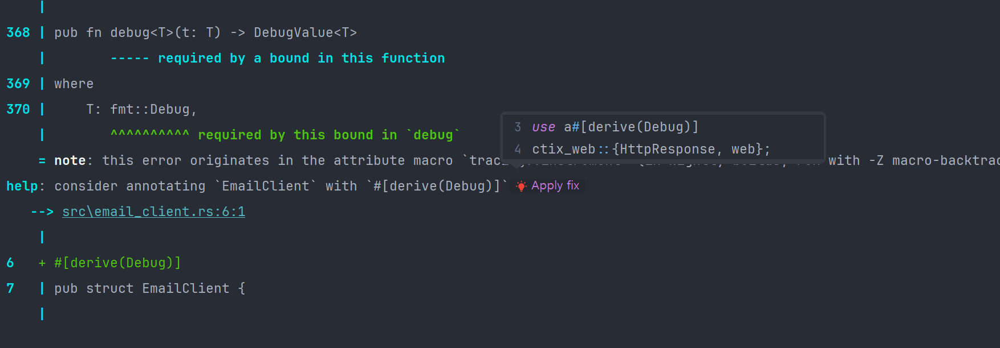
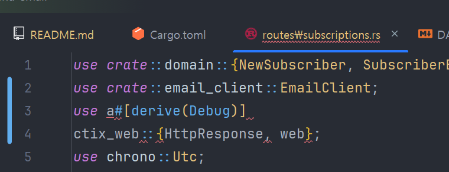

# zero2prod
제로부터 시작하는 러스트 백엔드 프로그래밍

### 사용자 스토리
블로그 방문자로서,  
뉴스레터를 구독하기를 원한다.  
그래야 새로운 컨텐츠가 블로그에 게시되었을 때 이메일로 알림을 받을 수 있다.  


### Serde

* serde는 러스트 데이터 구조를 효율적이고 제너릭하게 직렬화/역직렬화하기 위한 프레임워크이다.

```rust
#[derive(serde::Deserialize)]
struct FormData {
    email: String,
    name: String,
}

async fn subscribe(_form: web::Form<FormData>) -> HttpResponse {
    HttpResponse::Ok().finish()
}
```

* subscribe를 호출하기 전에 actix-web은 from_request 메서드를 모든 subscribe의 입력 인자에 대해 호출
* 바디를 역직렬화하고 URL 인코딩 규칙에 따라 FormData로 만듦. 이때 serde_urlencoded와 FormData의 Deserialize 구현을 활용. (#[derive(serde:Deserialize)]에 의해 자동 생성)
* from_request가 실패하면, 400 BAD Request가 호출자에게 반환된다. 성공하면 subscribe가 호출되고 200 Ok를 반환.


### SQLx

sqlx는 비동기 인터페이스를 가짐. 그러나 같은 db 커넥션에 대해 동시에 여러 쿼리를 실행할 수는 없다. 가변 참조자(mutable reference)를 요청하면 API에서 이를 보장하도록 강제한다.  
가변 참조자는 고유한 참조(unique reference)처럼 생각할 수 있다. 컴파일러는 그들이 실제로 그 PgConnection에 배타적 접근할 수 있음을 보장한다. 전체 프로그램에서 같은 시간에 같은 값에 대한 두 개의 활성화된 가변 참조자는 존재할 수 없기 때문이다.  
PgConnection을 lock(Mutex) 뒤에 놓음으로써 기반 TCP 소켓에 대한 접속을 동기화화고, lock을 얻은 뒤 감싸인 커넥션에 대한 가변 참조자를 얻어 동작을 하게 할 수 있다. 하지만 이상적이지는 않음. 한 순간에 하나의 쿼리만 실행할 수 밖에없기 때문.  
PgPool을 사용하면 해결 가능하다.  

<br>

버전 0.8에는 offline이 없는건가?  


### 로깅

tracing이 갓갓이다.  
<br>
[참고](https://docs.rs/tracing/latest/tracing/trait.Subscriber.html)

포맷한 로그  

```text
{"v":0,"name":"zero2prod","msg":"[ADDING A NEW SUBSCRIBER. - START]","level":30,"hostname":"DESKTOP-WEONTOP","pid":23468,"time":"2025-03-28T10:48:17.5413366Z","target":"zero2prod::routes::subscriptions","line":14,"file":"src\\routes\\subscriptions.rs","subscriber_name":"\"hee\"","subscriber_email":"\"tmp4@gmai.com\"","request_id":"334e64ef-5378-4ef3-b70d-8e763681088e"}
{"v":0,"name":"zero2prod","msg":"[SAVING NEW SUBSCRIBER DETAILS IN THE DATABASE - START]","level":30,"hostname":"DESKTOP-WEONTOP","pid":23468,"time":"2025-03-28T10:48:17.5422252Z","target":"zero2prod::routes::subscriptions","line":24,"file":"src\\routes\\subscriptions.rs","subscriber_name":"\"hee\"","subscriber_email":"\"tmp4@gmai.com\"","request_id":"334e64ef-5378-4ef3-b70d-8e763681088e"}
{"v":0,"name":"zero2prod","msg":"[SAVING NEW SUBSCRIBER DETAILS IN THE DATABASE - END]","level":30,"hostname":"DESKTOP-WEONTOP","pid":23468,"time":"2025-03-28T10:48:17.5494093Z","target":"zero2prod::routes::subscriptions","line":24,"file":"src\\routes\\subscriptions.rs","subscriber_name":"\"hee\"","subscriber_email":"\"tmp4@gmai.com\"","request_id":"334e64ef-5378-4ef3-b70d-8e763681088e","elapsed_milliseconds":0}
{"v":0,"name":"zero2prod","msg":"[ADDING A NEW SUBSCRIBER. - END]","level":30,"hostname":"DESKTOP-WEONTOP","pid":23468,"time":"2025-03-28T10:48:17.5498357Z","target":"zero2prod::routes::subscriptions","line":14,"file":"src\\routes\\subscriptions.rs","subscriber_name":"\"hee\"","subscriber_email":"\"tmp4@gmai.com\"","request_id":"334e64ef-5378-4ef3-b70d-8e763681088e","elapsed_milliseconds":7}
```

<br>

tracing-actix-web은 actix-web의 Logger를 대체하기 위해 설계되어 있으며, log가 아닌 tracing에 기반을 둠. 매 요청마다 일일이 작성해줄 필요가 없다.  
또한 tracing-opentelemetry를 설치하면 span을 OpenTelemetry 호환 서비스([Jagger](https://www.jaegertracing.io), [Honeycomb.io](https://honeycomb.io) 등)로 보내 심층적 분석 가능

### 도커

#### sqlx 오프라인 모드
바로 도커 빌드하면 오류가 발생한다. 이유는 sqlx 때문인데, sqlx는 테이블의 스키마를 고려해 모든 쿼리가 성공적으로 실행될 수 있도록 컴파일 시 데이터베이스를 호출한다. 하지만 cargo build를 도커 이미지 안에서 실행하면, sqlx는 .env 파일의 DATABASE_URL 환경 변수가 가리키는 데이터베이스와 커넥션을 만드는데 실패한다.  

```shell
cargo sqlx prepare -- --lib
```

도커 컨테이너 빌드 명령  

```shell
docker build --tag zero2prod --file Dockerfile .
```

도커 실행 명령  
```shell
docker run zero2prod
```

포트 노출하면서 실행  
이게 필요한 이유는 기본적으로 도커 이미지는 기반 호스트 머신에 포트를 노출하지 않음
```shell
docker run -p 8080:8080 zero2prod
```

```shell
curl --request POST --data 'name=redddy&email=hello@redddy.com' 127.0.0.1:8080/subscriptions --verboes
```
로 요청을 보내면 약 30초 정도가 지난 후 500이 돌아온다.  

이유는 connect를 connect_lazy로 바꿔 db를 직접 다루는 것을 회피했기 때문이다.  

### 도커 이미지 최적화하기

도커 파일에서 최적화할 수 있는 것은 **더 빠른 사용을 위한 작은 이미지 크기**와 **더 빠른 빌드를 위한 도커 레이어 캐싱**이 있다.  

러스트에서 docker build는 꽤 오래 걸린다. 


**step1** 
<br>

최적화하기 전에는 7.32GB 크기의 이미지였다.  



[최적화 전 Dockerfile 코드](dockerfile_history/start)  
<br>

**step2**
<br>

다단계 빌드를 사용하고 이미지를 빌드하는데 필요하지 않은 파일을 제거하기 위해 .dockerignore 파일에 명시를 해주고, 다단계 빌드를 사용하여 최적화 하니 820MB로 줄었다. 
이때 rust 버전에 -slim이 붙은 친구를 사용했는데 동일한 기반 OS를 사용하는 더 작은 이미지다. 러스트 툴체인과 용병(rustc, cargo 등)의 무게를 줄임으로써 더욱 크기를 줄일 수 있었다. 


[ignore 추가와 slim 사용](dockerfile_history/upgrade)

<br>

**step3**
<br>

여기에서 slim이 아니라 더 원시적인 OS를 사용하면 더욱 최적화가 가능하다.  



보면 96.6MB로 줄였다. 처음에 7.34GB 와 비교하면 굉장한 변화다.  

[윈시적인 OS 사용](dockerfile_history/os)


<br>

## 보안 제약 사항

우리가 대비해야 하는 것
* 도스 공격(denial-of-service attack, Dos attack): 서비스를 다운시켜 다른 사람들이 회원가입을 하지 못하게 한다. 모든 온라인 서비스의 공통적 위협
* 데이터 갈취(data theft): 거대한 이메일 주소 목록을 훔친다. 
* 피싱(phishing): 우리 서비스를 사용해서 합법적으로 보이는 이메일을 피해자에게 보내, 그들로 하여금 어떤 링크를 클릭하거나 다른 행동을 수행하게 속인다. 


## 이메일 검증

* email과 name에 대한 도메인 검증
* email 사용자의 확인
  * 인증 메일 보낸 후 확인

### 확인 이메일

* 이메일을 전송하는 모듈을 작성
* 기존의 POST /subscriptions 요청 핸들러 로직을 적용해서 새로운 명세를 매칭
* GET /subscriptions/confirm 요청 핸들러를 새로 작성

#### Arc

```rust
pub fn run(
  listener: TcpListener,
  db_pool: PgPool,
  email_client: EmailClient,
) -> Result<Server, std::io::Error> {
  let db_pool = Data::new(db_pool);
  // actix_web::web::data(Arc 포인터)로 EmailClient를 감싸고 App을 만들어야 할 때마다 포인터를 app_data로 보낸다. 
  // 아래 부분 없이도 동작은 가능하다. 그럼 어떤게 최선일까
  // EmailClient가 단순히 Client 인스턴스를 감싼 래퍼라면, 굳이 Arc를 사용해서 커넥션 풀을 두 번 감쌀 필요가 없다. 
  // 그러나 현재 EmailClient는 base_url과 sender 이렇게 두 개의 필드를 가지고 있다. Arc를 사용하지 않으면 App 인스턴스가 생성될 때마다 
  // 해당 데이터의 사본을 새로운 메모리에 할당한다. 한편 Arc로 감싼 경우 모든 인스턴스가 이걸 공유한다. 
  // 하지만 기억해야 할 건 스레드마다 App 인스턴스를 만든다는 것이다. 
  let email_client = Data::new(email_client); // 이부분을 주석하는 것이 Arc를 사용하지 않는것. 
  let server = HttpServer::new(move || {
    App::new()
            .wrap(TracingLogger::default())
            .route("/", web::get().to(greet))
            .route("/health_check", web::get().to(health_check))
            .route("/{name}", web::get().to(greet))
            .route("/subscriptions", web::post().to(subscribe))
            .app_data(db_pool.clone())
            .app_data(email_client.clone())
  })
          .listen(listener)?
          .run();
  Ok(server)
}
```


* I/O 동작을 수행할 때는 항상 타임아웃을 설정하도록 하자. 


### 버그 

apply fix 가 이상하게 동작한다.
Debug가 없어 컴파일에러가 발생하는 상황에서 `#[derive(Debug)]`를 추가하라고 apply fix 가 떴지만 이상한 곳을 라우팅하고 있다.  
rust-lang 버그인지 tracing 버그인지는 잘모르겠는데 시간날 때 알아보자. 



`email_client`에 가서 변경해야 하는데 엉뚱한 데 use 하는데 가있다. 


### 에러 핸들링

오류는 두 가지 목적을 갖음
(제인 러스비가 발표함) 후회하지 않을 영상이니 꼭 시청하자. https://youtu.be/rAF8mLI0naQ?si=rZGD1ty0Wya1KUu0  

* 제어 흐름(다음으로 할 것을 결정)
* 보고(사실 이후에 무엇이 잘못되었는지 조사)

오류의 위치에 기반해 다음을 구분할 수 있다.
* 내부(애플리케이션 안에서 다른 함수를 부르는 함수)
* 경계(목적을 달성하는 데 실패한 API 요청)

|       | 내부          | 경계    |
|-------|-------------|-------|
| 제어 흐름 | 타입, 메서드, 필드 | 상태 코드 |
| 보고    | 로그,트레이스     | 응답 바디 |


### 도서 글귀

* 영속성 요규가 명확하지 않다면, 관게형 데이터베이스를 사용하자. 큰 확장을 예상할 필요가 없다면, PostgreSQL을 사용하자.
* 스레드는 병렬로 동작한다. 비동기는 병렬로 대기한다. 
* 관측 가능성이란 여러분의 환경에 관해 임의로 질문을 던질 수 있는 속성을 말한다. 여기서 가장 중요한 것은 여러분이 무엇을 질문하기 원하는지 미리 알 필요가 없다는 점이다. 

### 학습 키워드 

* Arc: connection을 Arc에 담아서 넘겼다. 
* TryInfo: .try_into()와 try_from()을 적재적소에 사용하자.
* [AsyncDrop을 지원하지 않는 이유](https://github.com/rust-lang/rfcs/pull/2958)
* 트랜잭션 begin 하고 commit, rollback 둘 중 하나라도 하지 않으면 에러 발생.


### TODO LIST

* 사용자가 구독을 두 번 한다면? 두 번의 확인 이메일을 받는 것을 보장하자.
* 사용자가 확인 링크를 두 번 클릭하면 어떻게 되나
* 구독 토큰의 형태는 적절하지만 토큰이 실제로는 존재하지 않는다면,
* 유입되는 토큰에 대해 검증하기, 현재 사용자의 입력을 그대로 쿼리에 전달하고 있다. (다행이도 sqlx에서 sql 인젝션을 방지해준다.)

[깃허브 저장소](https://github.com/LukeMathWalker/zero-to-production)
